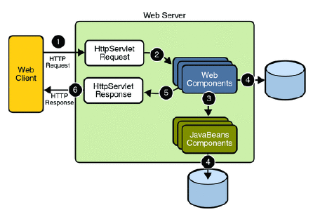
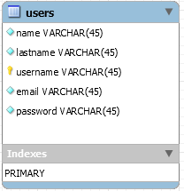

# AMT Project (Develop a Multi-Tiered App)


Date: 10/20/2016

Version 1.0

##Introduction
In this repositery we have a web application that runs on a wildfly server in which the application is autodeployed.  
The application is launch via a docker container.
The first part of the project is to apply the technologies, techniques and design patterns (MVC, DAO) presented during the Multi-Tiered Application course. We used Java EE application server, netbeans to develop that web application, and JAX-RS API in order to have a Restfull application.

##Goal
1. *Design and implement a page with a login and registration form*

2. *Implement a security filter to protect pages from unauthenticated users*

3. *Allow registered users to login and access protected pages and not access them anymore once they're not online*
4. *implement a REST API with JAX-RS*
5. *Use the DAO design pattern and JDBC to interact with the relational mysql database*

##Team members
Pascal Sekley : <pascal.sekley@heig-vd.ch>

Rodrigue Tchuensu : <rodrigue.tchuensu@heig-vd.ch>

##Requirement  
1 - Install docker and docker-compose if it is not yet the case. Click [here](https://www.docker.com/products/docker-toolbox) to install.  
2 - Clone this repo to a folder of your choice.
````
git clone git@github.com:pascalsekley/Projet-AMT.git (if you have an ssh configuration on github)  
git clone https://github.com/pascalsekley/Projet-AMT.git (for https cloning)
````
3 - You can use [docker machine windows](https://docs.docker.com/docker-for-windows/) for windows is you're on windows platform. And [docker machine mac](https://docs.docker.com/docker-for-mac/) if you're on mac OS platform.

##How to Run   
Assuming that you have cloned this repo and that you have installed docker on your machine.
Once you're in the root you have to build the app. Let's compile the war first using the [Maven](https://maven.apache.org) command:

1 - `mvn compile war:war`. 

Let's copy now the war file generated by the previous command into the same folder as the dockerfile.

2 - `cp target/project-1.0-SNAPSHOT.war images/wildfly/`

Navigate to the folder named topology-amt of the cloned directory and fire up docker-compose to start the server :
  
`docker-compose up --build`  
Notice that once the server is started the application is automatically deployed.That command will also create two other containers. One will run phpmyadmin and the other one mysql.
**URL to Access** are :
````
http://192.168.99.100:9090 (wildfly server  welcome page)    
http://192.168.99.100:9090/project-1.0-SNAPSHOT (application)  
http://192.168.99.100:9990(console -> admin/admin)  
````  

To access the management wildfly console use this link: `http://192.168.99.100:9990/console/App.html`

the username is admin and the password is admin

To access the phpmyadmin console use this link: `http://192.168.99.100:6060/`

the `username is root` and the `password is adminpw`

To know more about auto-deployment.
Click [here](https://hub.docker.com/r/jboss/wildfly)


##The database

> We decided to use as unique ID the username of a user with is supposed to identify a user in our database. The username is the primary key in that case.

##REST API


*Hope you enjoyed using our application, thanks for stopping by ...*